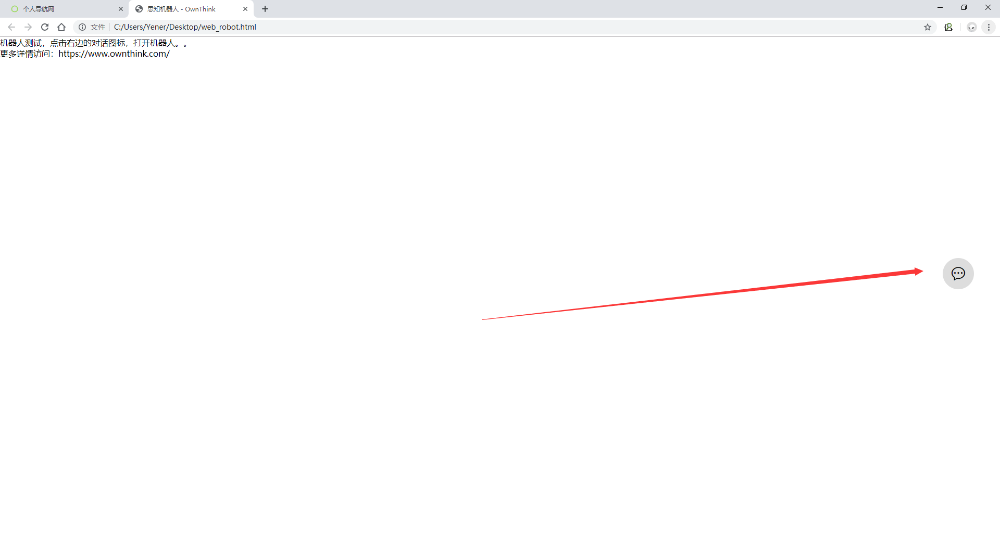
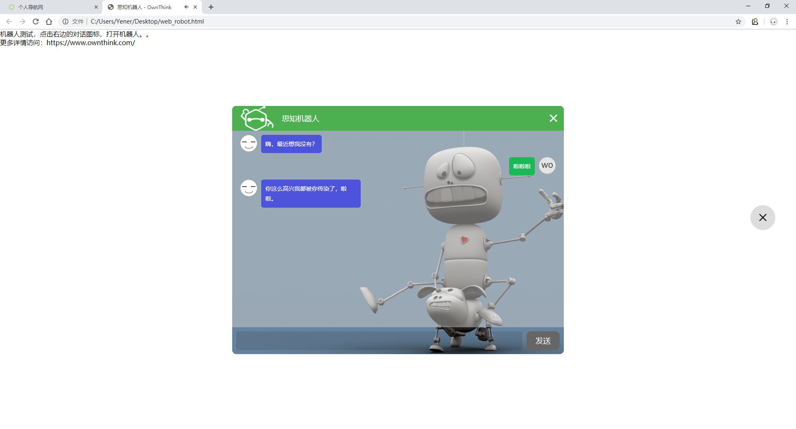

网页机器人，将`<script type="text/javascript" src="https://robot.ownthink.com/bot/js/robot.js?appid=xiaosi"></script>`加入到`</body>`前面即可引入机器人，appid参数可设置自己创建的机器人appid，注意不要加到头部，是加到`</body>`前。

html代码示范：
```html
<html>
<head>
<meta charset="UTF-8">
<title>思知机器人 - OwnThink</title>
</head>

<body>

<p>机器人测试，点击右边的对话图标，打开机器人。。</p>

<p>更多详情访问：https://www.ownthink.com/</p>


<script type="text/javascript" src="https://robot.ownthink.com/bot/js/robot.js?appid=xiaosi"></script>

</body>
</html>
```





